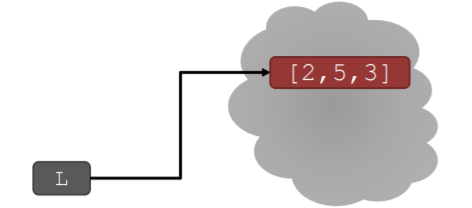

# Python

## 튜플과 리스트[TupleAndList.py](TupleAndList.py)

> 튜플과 리스트의 차이를 보고 어떻게 활용하는지 본다.

### 튜플

> 각 요소의 순차적 연속, 여러 타입이 섞일 수 있음
>
> 값을 바꿀 수 없음.
>
> `()`로 표시함

#### 튜플 예시

`te = ()` 비어있는 튜플

`t = (2,"mit",3)`

`t[0]` 2가 나옴

`(2,"mit",3) + (5,6)` -> `(2,"mit",3,5,6)`

`t[1:2]` -> `("mit", )` 

> `,`는 튜플에 데이터가 하나라는 뜻.


### 리스트

> 정보의 순차적 연속
>
> `[]`
>
> 대부분 하나의 타입을 담음(다른 타입도 담을 수 있음)
>
> 각 엘리먼트는 변경 가능(mutable)


#### 인덱스와 순서

`a_list=[]` 빈 리스트

`L=[2, 'a', 4, [1,2]]` 여러가지를 담은 리스트

`len(L)` -> 4

`L[0]` -> 2

`L[2]+1`  -> 5

`L[3]` -> [1,2]

`L[4]` -> 에러 

```python
i=2
L[i-1] -> L[1]
```

#### 엘리먼트 바꾸기

> 리스트는 변경가능(mutable)
>
> 어느 인덱스의 엘리먼트를 바꾸는 것은 그 값을 변경시킴.

```python
L = [2,1,3]
L[1] = 5
L = [2,5,3]
```



#### 리스트 반복하기

> 리스트의 값 더하기

```python
total = 0
	for i in range(len(L)):
        total += L[i]
    print total
```

```python
total = 0
	for i in L:
        total += i
    print total
```

#### 리스트에 계산하기 - ADD

> 리스트 마지막에 값 더하기 L.append(element)

```python
L=[2,1,3]
L.append(5)
L = [2,1,3,5]
```

 `L.append`[^1][^2][^3]


> Concantenation `+` 이용하기
>
> L.extend(some_list) (mutate)

```python
L1 = [2,1,3]
L2 = [4,5,6]
L3 = L1 + L2 -> [2,1,3,4,5,6]
L1.extend([0,6]) -> L1이 바뀜 [2,1,3,0,6]
```


## FootNote

[^1]:파이썬의 모든 것은 `object`. 
[^2]:모든 `object` 는 methods 와 function을 가짐
[^3]: `object_name.do_something()`의 방식으로 할 수 있음.


